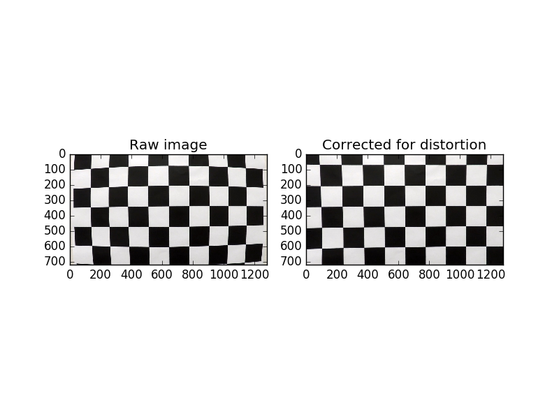
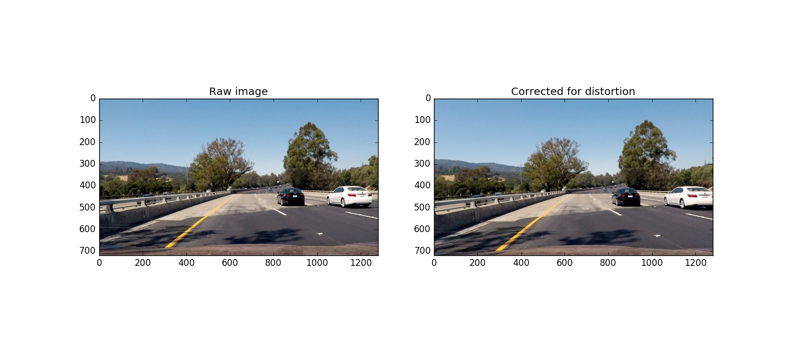
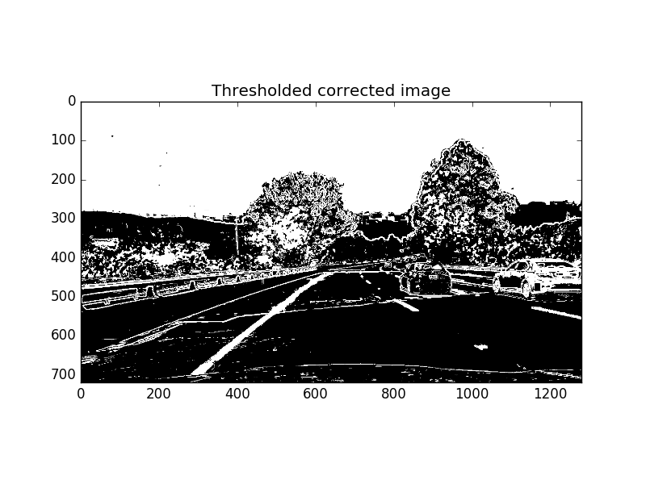
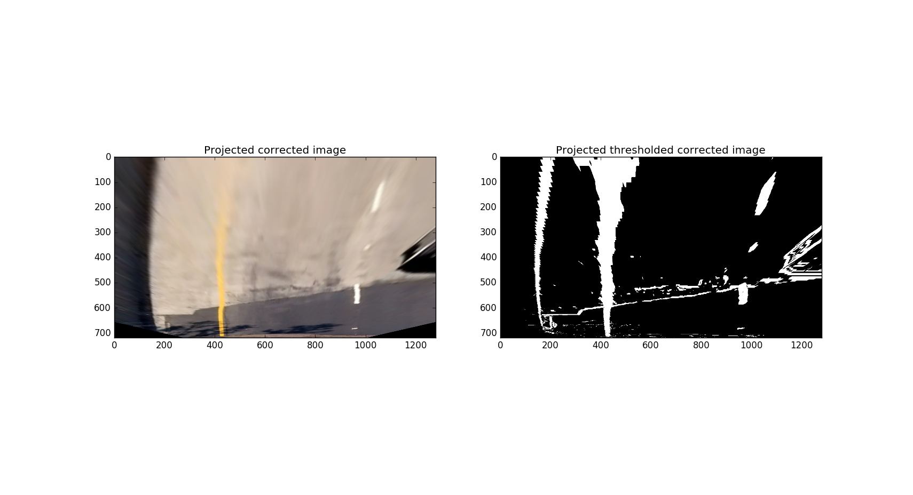
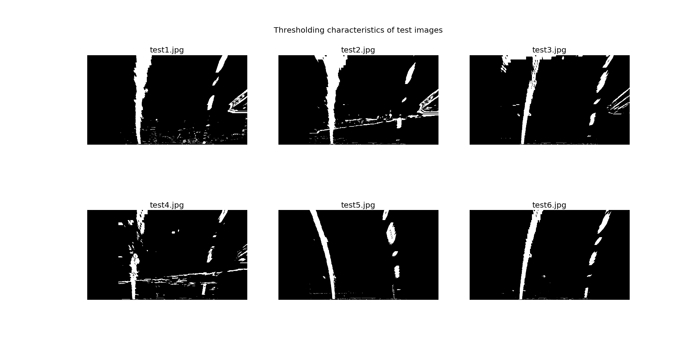
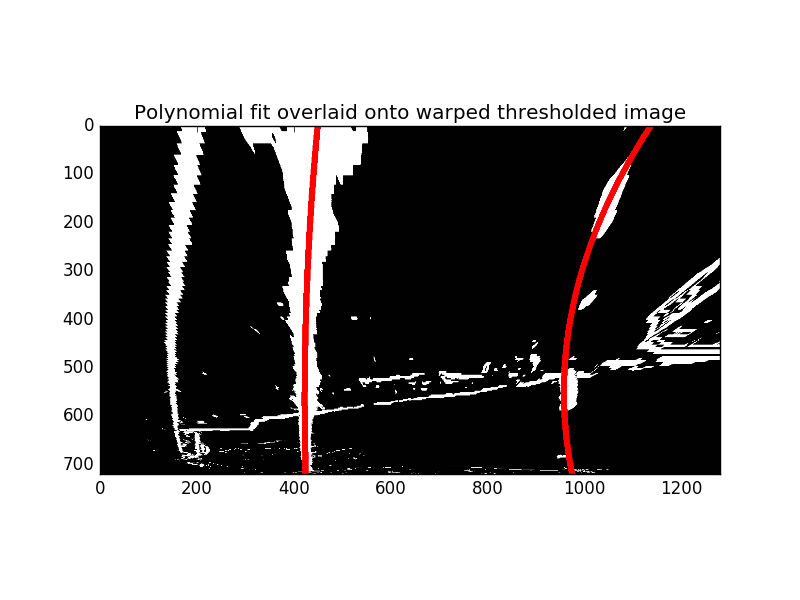
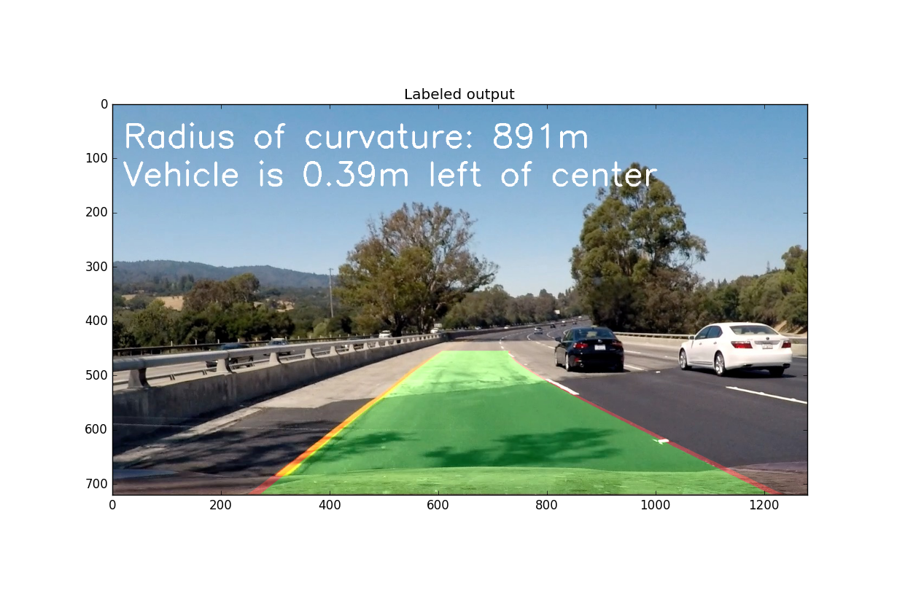

# Advanced Lane Finding

My work for Udacity's Self-Driving Car Nanodegree, Project 4

## Camera Calibration

My code for calibrating camera images is located in [code/calibrate.py](code/calibrate.py). This script takes the following steps:

1. In `get_images()`, the calibration images from `camera_cal/` are loaded via the `glob` API. I noticed that some of these images were 1 pixel too large, so I standardize their dimensions to 1280x720.
2. In `find_objpoints_and_imgpoints_for_camera()`, image points are determined for each image via `cv2.findChessboardCorners()` if possible. Note that some of the calibration images are cropped with chessboard corners missing, so these images are excluded from calibration.
3. `cv2.calibrateCamera()` uses the image points and corresponding object points to generate calibration data.
4. This data is pickled and saved to a file for future use without having to recalculate the calibration data each time.

We can verify the correctness of this calibration by comparing a raw chessboard photo to the distortion-corrected version:

## Image Pipeline

Functions used for various image processing and manipulation tasks can be found in [code/process_image.py](code/process_image.py).

### Distortion Correction

In `process_image.py:correct_distortion()`, images are distortion-corrected using `cv2.undistort()` and pre-computed calibration data. We can see distortion correction applied to an image of the road below. Note the slight difference between the two images:

### Image Thresholding

All image thresholding functions can be found in [code/process_image.py](code/process_image.py). `thresholded_image()` is the main thresholding function, which calls on several utilities to process various aspects of the input image.

I was able to produce decent results with the following approach:

1. Produce X and Y Sobel gradients via `abs_sobel_thresh()`.
2. Produce the magnitude of the Sobel operator over the image via `mag_thresh()`. Note: I intended to do this over both grayscale and the S channel of the HLS version of the image. I noticed after-the-fact that I forgot to use `mag_thresh_s()`, so the `mag_binary` variable is superceded by `mag_binary_s`.
3. High-threshold the image over H and S values via `hls_select_h()` and `hls_select_s()`.
4. Low-threshold the image over L and S values via `hls_select_l()` and `hls_select_s()`.
5. Include pixels that meet the Sobel operator thresholds.
6. Include pixels that are above high H and S thresholds.
7. Exclude pixels that are below low L and S thresholds.

The threshold and kernel values were chosen experimentally based on the test images and samples of particularly difficult parts of the project video.

An example of a thresholded image is shown below:

### Perspective Transform

Perspective transforms were performed via `code/process_image.py:warp_perspective()`. The source and destination values for generating the perspective transform matrices are found in the `src` and `dst` variables in [code/processing_utils.py](code/processing_utils.py).

An example of a perspective-transformed image along with its thresholded counterpart is shown below:

With distortion correction, image thresholding, and perspetive transforms complete, I was able to experiment with thresholding values to make the lane lines as visible as possible while minimizing the presence of other features and disruption due to shadows and color changes. My results on multiple test images are shown below:

### Polynomial Fit

Code for producing polynomial fits is found in [code/find_lane_lines.py](code/find_lane_lines.py). Two main functions, both of which were presented in the Advanced Lane Finding lessons, were used:

1. `find_lines_via_histogram_peaks()`. This function takes a thresholded, perspective-transformed image and scans across the X axis of the image for peaks where there are many 1-valued pixels along the Y axis. Based on these peaks, the algorithm will continue "climbing up" the Y axis, searching within a margin of the peak for areas of high 1-valued pixel density. These values are then used to produce the polynomial fit. This method is used to initially find or recalculate the fits for the lane lines.
2. `find_lines_via_polynomial_fit()`. This function requires polynomial fits to have previously been determined and assumes that this image's lines are not far off from these fits. This algorithm simply searches for points within a margin of the polynomial fits and generates a new polynomial fit based on these points.

An example of polynomial fits found via the `find_lines_via_histogram_peaks()` method is shown below, overlaid onto a perspective-warped thresholded image. Note that this image demonstrates how this technique can perform poorly if lines are fuzzy like the left line or sparse like the right line:

### Radius of Curvative and Vehicle Center Offset

Code for estimating the radius of curvative is found in `code/find_lane_lines.py:estimate_radius()`. This function implements the radius of curvature formula presented in the Advanced Lane Finding lesson. This function is called by `find_lines_via_histogram_peaks()` and `find_lines_via_polynomial_fit()`, and the resulting radii estimates are returned along with the polynomial fits.

Code for determining the center offset is found in `code/processing_utils.py:get_center_offset()`. This function uses the polynomial fits determined earlier and evaluates them at the bottom of the image. The camera is assumed to be mounted at the center of the car, and therefore the vehicle's center is assumed to be the midpoint of the image. The center of the evaluation of the fits is the center of the road, and therefore the offset of the vehicle's center is the offset from this point.

### Projection of Lane Lines

Code for plotting results and projecting it onto an image of the road is found in [code/plotting_utils.py](code/plotting_utils.py). `add_lines_to_image()` is the function which takes a warped image and polynomial fits of the lane lines and projects them onto the road.

Additionally, `add_radius_to_image()` adds the radius of curvature to the image. The radius of curvature is taken to be the average of the radii that the left and right lane polynomial fits produce. `add_center_offset_to_image()` is used to add the center offset to the image.

An example of a fully-processed image is shown below:

## Video Pipeline

My final video output can be found in [project_video_output.mp4](project_video_output.mp4).

The code used to produce this output can be found in [code/render_video.py](code/render_video.py), with the main logic found in `process_frame()`. The video processing pipeline code uses all of the techniques discussed earlier. Additionally, a few other techniques are used:

* The last 5 polynomial fits and radii of curvature are cached. These results are averaged before producing the polynomial values used for plotting and before producing the center offset. This smooths out variation in input so bad frames are less likely to break the pipeline.
* For the project video specifically, the left edge of the thresholded image data is clipped. This is because the shadow produced by the left wall was exceedingly hard to differentiate from an actual lane line. Since it always occurs in approximately the same place, I was able to safely discard it from the polynomial fitting data.

Each video frame is distortion corrected, thresholded, and perspetive-warped. Following these steps, the processing pipeline works the following way:

1. The first video frame is processed. Polynomial fits are found via the `find_lines_via_histogram_peaks()` method.
2. On subsequent frames, a previous fit is available, so this is used to more quickly find the next polynomial fit via the `find_lines_via_polynomial_fit()` method.
3. If a fit's radius of curvature is below 200m, it is assumed to be a bad result. The previous fit is used instead, and a "bad try" counter is incremented.
4. If the lane lines are calculated to be too wide or not wide enough at any point, it is assumed to be a bad result. The previous fits are used instead, and a "bad try" counter is incremented.
5. If there were too many consecutive (in this case 4) "bad tries", the algorithm is assumed to be lost. The `find_lines_via_histogram_peaks()` method is used to carefully recalculate the polynomial fits.
6. The polynomial fits, along with the radii of curvative and the center offset, are projected onto the frame.
7. The video frames are compiled into the output video.

## Discussion

The most difficult part of this project by far was thresholding the image satisfactorily. Shadows and color transitions were particularly difficult to filter out while maintaining enough lane line data, although I eventually found a process that worked well for these. However, the features used to emphasize the lane lines also heavily emphasized the edge of the shadow produced by the left wall. I ultimately never found a good way to filter this out and resorted to manually clipping it, since it was consistent and close enough to the edge that I could safely do so without compromising lane line data.

Given the above, any other strong vertical lines (as seen in the perspective-transformed image) would likely cause the pipeline to fail. Highway street lights could easily project tall, thin shadows onto the road that could be mistaken for lane lines.

I noticed that the white dotted line was often patchy and lacked density. Any area where the lines are thin, sparse, or similar in color to the road (as with the faded yellow line on the concrete road) can cause the pipeline to fail.

This code also assumes that there is sufficient space between the camera car and the car in front of it, so enough of the lane lines are visible. A car passing too close in front of the camera car could disrupt the pipeline.

In addition to improving the thresholding code, more rigorous polynomial fitting code could be used. It was demonstrated above that this code can easily fail. A potential improvement would be to compare the distances and curvatures of the fits in the polynomial fitting code and attempt to patch it in place, rather than taking the fits as face value and rejecting them if they aren't good enough.

An improvement to how the fits are projected onto the video would be to track the fits for a longer time but weigh them with a decaying exponential function. This way more recent fits are weighted more strongly, but past data isn't discarded entirely. It could be tricky to determine the right amount of decay and the right number of iterations to keep. however,
